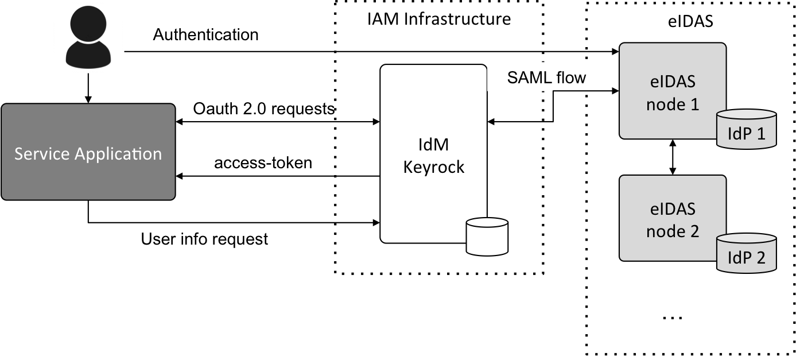
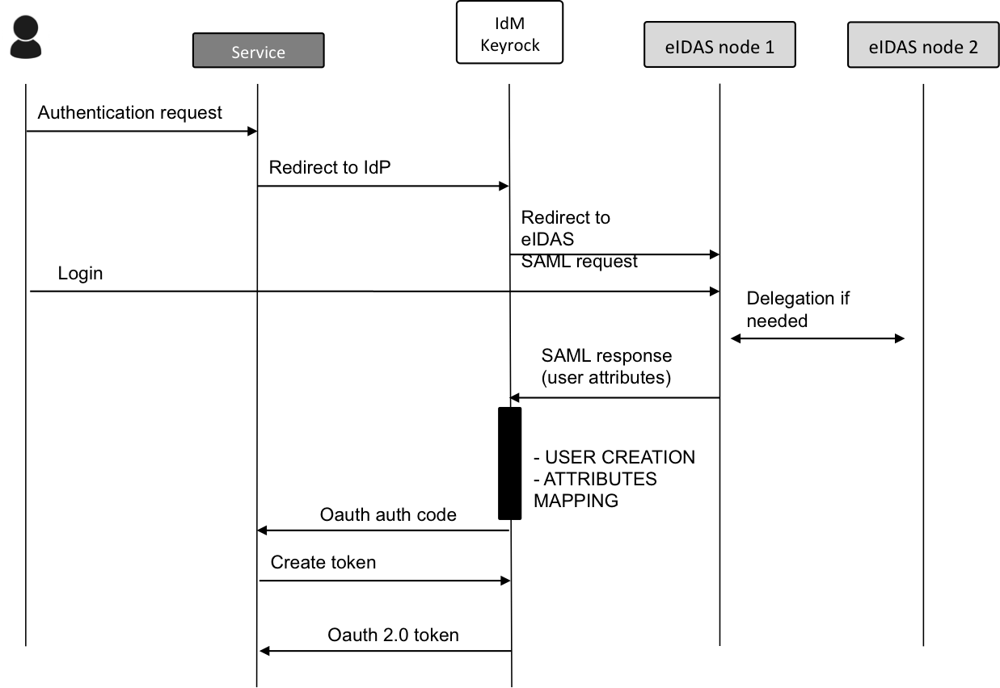
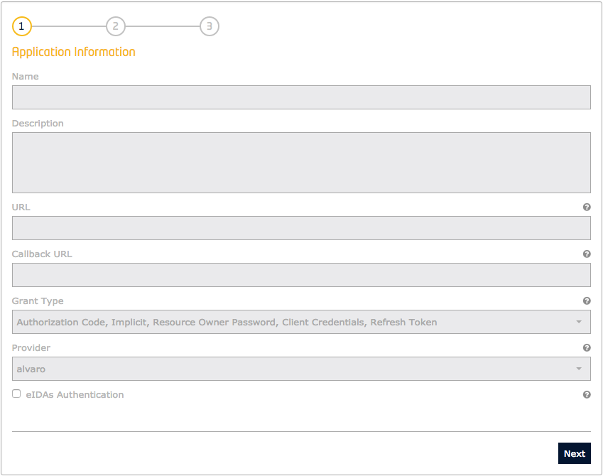
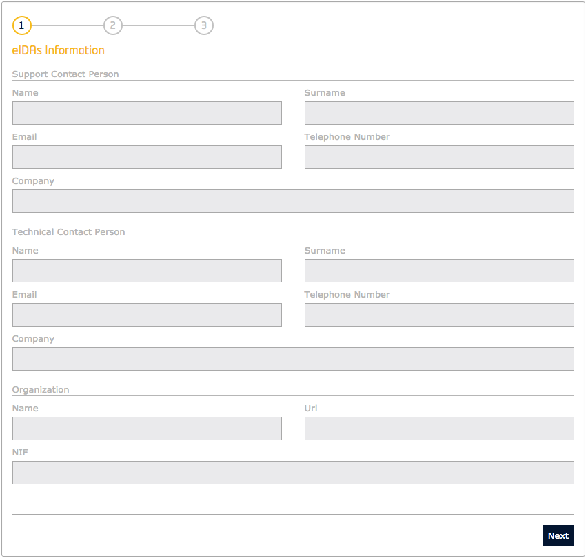
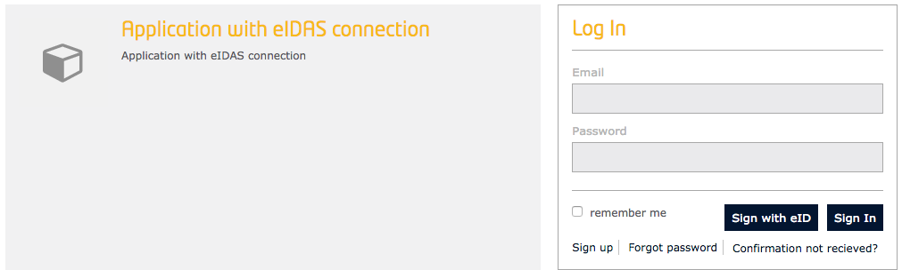
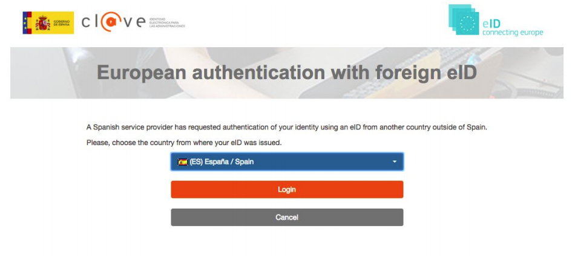
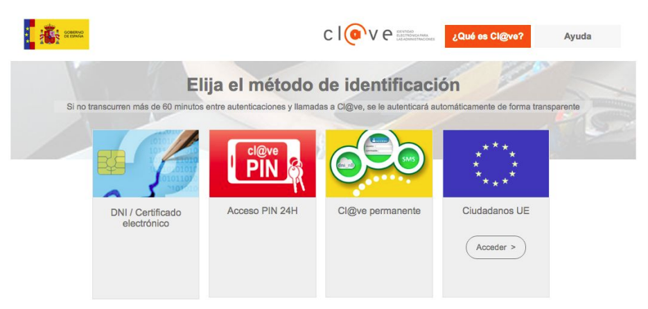

# How to deal with GDPR with Orion-LD

[](https://www.etsi.org/deliver/etsi_gs/CIM/001_099/009/01.03.01_60/gs_cim009v010301p.pdf)
[](https://github.com/FIWARE/catalogue/blob/master/security/README.md)
[](https://opensource.org/licenses/MIT)
[](https://stackoverflow.com/questions/tagged/fiware)
[](https://w3c.github.io/json-ld-syntax/)
[](https://fiware-tutorials.rtfd.io)

This tutorial uses the [FIWARE Wilma](https://fiware-pep-proxy.rtfd.io/) PEP Proxy combined with
[FIWARE Keyrock](https://fiware-idm.readthedocs.io/en/latest/) to secure access to
[FIWARE Orion-LD](https://github.com/FIWARE/context.Orion-LD) endpoints exposed by FIWARE generic
enablers. Users (or other actors) must log-in and use a token to gain access to the services.

[Postman documentation](https://fiware.github.io/tutorials.PEP-Proxy/) for these calls is also available.

[](https://app.getpostman.com/run-collection/6b143a6b3ad8bcba69cf)

## Contents

<details>
<summary><strong>Details</strong></summary>

- [Securing Microservices with an Identity Management and a PEP Proxy](#securing-microservices-with-an-identity-management-and-a-pep-proxy)
  - [Introduction to the solution](#introduction-to-the-solution)
  - [Standard Concepts of Identity Management](#standard-concepts-of-identity-management)
  - [Video: Introduction to Keyrock](#arrow_forward-video-introduction-to-keyrock)
  - [Video: Introduction to Wilma PEP Proxy](#arrow_forward-video-introduction-to-wilma-pep-proxy)
- [Prerequisites](#prerequisites)
  - [Docker and Docker Compose](#docker-and-docker-compose-)
  - [Cygwin (for Windows)](#cygwin-for-windows-)
  - [Postman](#postman-)
  - [http](#http-)
  - [jq](#jq-)
- [Architecture](#architecture)
- [Start Up](#start-up)
  - [Dramatis Personae](#dramatis-personae)
  - [Logging In to Keyrock using the REST API - Getting admin token](#logging-in-to-keyrock-using-the-rest-api---getting-admin-token)
- [Users management](#users-management)
  - [Creating Users](#creating-users)
  - [List all Users](#list-all-users)
- [Grouping User Accounts under Organizations](#grouping-user-accounts-under-organizations)
  - [Create an Organization](#create-an-organization)
  - [List all Organizations](#list-all-organizations)
  - [Assign users to organizations](#assign-users-to-organizations)
  - [List Users within an Organization](#list-users-within-an-organization)
- [Managing Roles and Permissions](#managing-roles-and-permissions)
  - [Create an Application](#create-an-application)
  - [Create a Permission](#create-a-permission)
  - [List Permissions](#list-permissions)
  - [Create a Role](#create-a-role)
  - [Assigning Permissions to each Role](#assigning-permissions-to-each-role)
  - [List Permissions of a Role](#list-permissions-of-a-role)
- [PEP Proxy](#pep-proxy)
  - [Create a PEP Proxy](#create-a-pep-proxy)
  - [Read PEP Proxy details](#read-pep-proxy-details)
- [Authorizing Application Access](#authorizing-application-access)
  - [Grant a Role to an Application](#grant-a-role-to-an-application)
  - [Grant a Role to a User](#grant-a-role-to-a-user)
- [Securing Orion-LD](#securing-orion-ld)
  - [PEP Proxy - No Access to Orion-LD without Access Token](#pep-proxy---no-access-to-orion-ld-without-access-token)
  - [Keyrock - User obtains Access Token](#keyrock---user-obtains-access-token)
  - [PEP Proxy - Accessing Orion-LD with an Authorization - Alice user](#pep-proxy---accessing-orion-ld-with-an-authorization---alice-user)
  - [PEP Proxy - Accessing Orion-LD with an Authorization - Managers (e.g. Bob)](#pep-proxy---accessing-orion-ld-with-an-authorization---managers-eg-bob)
  - [PEP Proxy - Accessing Orion-LD with an Authorization - Users (e.g. Charlie)](#pep-proxy---accessing-orion-ld-with-an-authorization---users-eg-charlie)
  - [PEP Proxy - Accessing Orion-LD with an Authorization - Data owners (e.g. Ole)](#pep-proxy---accessing-orion-ld-with-an-authorization---data-owners-eg-ole)
  - [PEP Proxy - Accessing Orion-LD with an Authorization - Other users (e.g. Eve)](#pep-proxy---accessing-orion-ld-with-an-authorization---other-users-eg-eve)
- [Integration with eIDAS](#integration-with-eidas)
  - [Architecture of the integration](#architecture-of-the-integration)
  - [IdM server configuration](#idm-server-configuration)
  - [Registering an application as an eIDAS Service Provider](#registering-an-application-as-an-eidas-service-provider)
  - [User authentication](#user-authentication)

</details>

## Securing Microservices with an Identity Management and a PEP Proxy

### Introduction to the solution

> "Oh, it's quite simple. If you are a friend, you speak the password, and the doors will open."
>
> — Gandalf (The Fellowship of the Ring by J.R.R Tolkien)

The [previous tutorial](https://github.com/FIWARE/tutorials.Securing-Access) demonstrated that is possible to Permit
or Deny access to resources based on an authenticated user identifying themselves within an application. It is a
matter of the code following a different line of execution if the `access_token` was not found (Level 1 -
_Authentication Access_), or confirming that a given `access_token` had appropriate rights (Level 2 - _Basic
Authorization_). The same method of securing access can be applied by placing a Policy Enforcement Point (PEP) in front
of other services within a FIWARE-based Smart Solution.

A **PEP Proxy** lies in front of a secured resource and is an endpoint found at "well-known" public location. It serves
as a gatekeeper for resource access. Users or other actors must supply information to the **PEP Proxy** to allow
their request to succeed and pass through the **PEP proxy**. The **PEP proxy** then passes the request on to the real
location of the secured resource itself - the actual location of the secured resource is unknown to the outside
user - it could be held in a private network behind the **PEP proxy** or found on a different machine altogether.

FIWARE [Wilma](https://fiware-pep-proxy.rtfd.io/) is a simple implementation of a **PEP proxy** designed to work with
the FIWARE [Keyrock](https://fiware-idm.readthedocs.io/en/latest/) Generic Enabler. Whenever a user tries to gain access
to the resource behind the **PEP proxy**, the PEP will describe the user's attributes to the Policy Decision Point
(PDP), request a security decision, and enforce the decision. (Permit or Deny). There is minimal disruption of access
for authorized users - the response received is the same as if they had accessed the secured service directly.
Unauthorized users are answered with a **401 - Unauthorized** response.

### Standard Concepts of Identity Management

The following common objects are found with the **Keyrock** Identity Management database:

- **User**, any signed-up user able to identify themselves with an eMail and password. Users can be assigned rights
  individually or as a group.
- **Application**, any securable FIWARE application consisting of a series of microservices.
- **Organization**, a group of users who can be assigned a series of rights. Altering the rights of the organization
  effects the access of all users of that organization.
- **OrganizationRole**, users can either be members or admins of an organization - Admins are able to add and remove
  users from their organization, members merely gain the roles and permissions of an organization. This allows each
  organization to be responsible for their members and removes the need for a super-admin to administer all rights.
- **Role**, a role is a descriptive bucket for a set of permissions. A role can be assigned to either a single user
  or an organization. A signed-in user gains all the permissions from their own roles plus the roles associated to
  their organization.
- **Permission**, an ability to do something on a resource within the system.

Additionally, two further non-human application objects can be secured within a FIWARE application:

- **IoTAgent**, a proxy between IoT Sensors and the Context Broker.
- **PEPProxy**, a middleware for use between generic enablers challenging the rights of a user.

The relationship between the objects can be seen below - the entities marked in red are used directly within this
tutorial:


### :arrow_forward: Video: Introduction to Keyrock

[](https://www.youtube.com/watch?v=dHyVTan6bUY "Introduction")

Click on the image above to watch an introductory video

### :arrow_forward: Video: Introduction to Wilma PEP Proxy

[](https://www.youtube.com/watch?v=8tGbUI18udM "Introduction")

Click on the image above to see an introductory video

## Prerequisites

### Docker and Docker Compose 

To keep things simple both components will be run using [Docker](https://www.docker.com). **Docker** is a container
technology which allows to different components isolated into their respective environments.

- To install Docker on Windows follow the instructions [here](https://docs.docker.com/docker-for-windows/)
- To install Docker on Mac follow the instructions [here](https://docs.docker.com/docker-for-mac/)
- To install Docker on Linux follow the instructions [here](https://docs.docker.com/install/)

**Docker Compose** is a tool for defining and running multi-container Docker applications. A
[YAML file](https://raw.githubusercontent.com/Fiware/tutorials.Identity-Management/master/docker-compose.yml) is used
configure the required services for the application. This means all container services can be brought up in a single
command. Docker Compose is installed by default as part of Docker for Windows and Docker for Mac, however Linux users
will need to follow the instructions found [here](https://docs.docker.com/compose/install/)

You can check your current **Docker** and **Docker Compose** versions using the following commands:

```bash
docker-compose -v
docker version
```

Please ensure that you are using Docker version 18.03 or higher and Docker Compose 1.21 or higher and upgrade if
necessary.

### Cygwin (for Windows) 

We will start up our services using a simple bash script. Windows users should download
[cygwin](http://www.cygwin.com/) to provide a command-line functionality similar to a Linux
distribution on Windows.

### Postman 

Postman is a collaboration platform for API development. Postman's features simplify each step of building an API and
streamline collaboration, therefore you can create better APIs—faster. To install Postman, follow the instructions
[here](https://www.postman.com/downloads).

### http 

This is a command line HTTP client, similar to curl or wget, with JSON support, syntax highlighting, persistent
sessions, and wget-like downloads with an expressive and intuitive syntax. `http` can be installed on each
operating system. Follow the instructions described [here](https://httpie.io/docs#installation).

### jq 

This is a program to slice, filter and map the content of JSON data. This is a useful tool to extract certain
information automatically from the HTTP responses. `jq` is written in C with no dependencies and can be use
on nearly any platform. Prebuilt binaries are available for Linux, OS X and Windows. For more details how to install
the tool you can go [here](https://stedolan.github.io/jq/download).

## Architecture

This application protects access to the existing Stock Management and Sensors-based application by adding PEP Proxy
instances around the services created in previous tutorials and uses data pre-populated into the **MySQL** database
used by **Keyrock**. It will make use of four FIWARE components - the
[Orion Context Broker](https://fiware-orion.readthedocs.io/en/latest/), the
[Keyrock](https://fiware-idm.readthedocs.io/en/latest/) Generic enabler and adds one or two instances
[Wilma](https://fiware-pep-proxy.rtfd.io/) PEP Proxy dependent upon which interfaces are to be secured.

The Orion-LD Context Broker rely on open source [MongoDB](https://www.mongodb.com/) technology to keep persistence
of the information they hold. **Keyrock** uses its own [MySQL](https://www.mysql.com/) database. The architecture
consists of the following elements:

- The FIWARE [Orion Context Broker](https://fiware-orion.readthedocs.io/en/latest/) which will receive requests using
  [NGSI-LD](https://forge.etsi.org/swagger/ui/?url=https://forge.etsi.org/gitlab/NGSI-LD/NGSI-LD/raw/master/spec/updated/full_api.json).
- FIWARE [Keyrock](https://fiware-idm.readthedocs.io/en/latest/) offer a complement Identity Management System
  including:
  - An OAuth2 authentication system for Applications and Users.
  - A site graphical frontend for Identity Management Administration.
  - A REST API for Identity Management via HTTP requests.
- FIWARE [Wilma](https://fiware-pep-proxy.rtfd.io/) is a PEP Proxy securing access to the **Orion** microservice.
- The underlying [MongoDB](https://www.mongodb.com/) database:
  - Used by the **Orion-LD Context Broker** to hold context data information such as data entities, subscriptions and
    registrations.
  - Used by the **IoT Agent** to hold device information such as device URLs and Keys.
- A [MySQL](https://www.mysql.com/) database:
  - Used to persist user identities, applications, roles and permissions.

Since all interactions between the elements are initiated by HTTP requests, the entities can be containerized and run
from exposed ports.

The specific architecture of each section of the tutorial is discussed below.

## Start Up

To start the installation, do the following:

```console
git clone https://github.com/FIWARE/tutorials.PEP-Proxy.git
cd tutorials.PEP-Proxy
git checkout NGSI-v2

./services create
```

> **Note** The initial creation of Docker images can take up to three minutes

Thereafter, all services can be initialized from the command-line by running the
[services](https://github.com/flopezag/tutorials.secured-OrionLD/blob/main/services)
Bash script provided within the repository:

```console
./services <command>
```

Where `<command>` will be help, start, stop or create.

> :information_source: **Note:** If you want to clean up and start over again you can do so with the following command:
>
> ```console
> ./services stop
> ```

### Dramatis Personae

The following people at `test.com` legitimately have accounts within the Application

- Alice, she will be the Administrator of the **Identity Management** Application. The account is created in the
  initialization process of the Identity Management.
- Bob, administrator of the application, he has access to read and write the Personal Data store in the application.
- Charlie, he is an application's user. He needs to read the Personal Data of the users but cannot modify them.

The following people at `example.com` have signed up for accounts, but have no reason to be granted access
to the data

- Eve - Eve the Eavesdropper.
- Mallory - Mallory the malicious attacker.

The following people at `xyz.foo` have signed up for accounts and can access to their Personal Data for reading
and writing only:

- Ole.
- Torsten.
- Frank.
- Lothar.

<details>
  <summary>
   For more details <b>(Click to expand)</b>
  </summary>

   | Name       | eMail                          | Password |
   | ---------- | ------------------------------ | -------- |
   | Alice      | `alice-the-admin@test.com`     | `test`   |
   | Bob        | `bob-the-appmanager@test.com`  | `test`   |
   | Charlie    | `charlie-the-appuser@test.com` | `test`   |

   | Name    | eMail                 | Password |
   | ------- | --------------------- | -------- |
   | Eve     | `eve@example.com`     | `test`   |
   | Mallory | `mallory@example.com` | `test`   |

   | Name    | eMail                     | Password |
   | ------- | ------------------------- | -------- |
   | Ole     | `ole-lahm@xyz.foo`        | `test`   |
   | Torsten | `torsten-kuehl@xyz.foo`   | `test`   |
   | Frank   | `frank-king@xyz.foo`      | `test`   |
   | Lothar  | `lothar-lammich@xyz.foo`  | `test`   |

</details>

Three organizations have also been set up by Alice:

| Name       | Description                          |
| ---------- | ------------------------------------ |
| Managers   | Project Managers of the Personal Data application with full control access.          |
| Users      | Project Users of the Personal Data application with read control access.             |
| Data       | Personal Data owners who can read and modify only their own data.                    |
| Others     | Rest of IdM registered users not authorized to access the Personal Data Application. |

One application, with appropriate roles and permissions has also been created:

| Key           | Value                                  |
| ------------- | -------------------------------------- |
| Client ID     | `tutorial-dckr-site-0000-xpresswebapp` |
| Client Secret | `tutorial-dckr-site-0000-clientsecret` |
| URL           | `http://localhost:3000`                |
| RedirectURL   | `http://localhost:3000/login`          |

### Logging In to Keyrock using the REST API - Getting admin token

Enter a username and password to enter the application. The default user has the values `alice-the-admin@test.com`
and `test`. The following example logs in using the Admin User, if you want to obtain the corresponding tokens for
the other users after their creation just change the proper name and password data in this request:

#### :one: Request

```console
http POST http://localhost:3005/v1/auth/tokens \
  name=alice-the-admin@test.com \
  password=test
```

#### :one: Response

The response header returns an `X-Subject-token` which identifies who has logged on the application. This token is
required in all subsequent requests to gain access

```bash
HTTP/1.1 201 Created
Cache-Control: no-cache, private, no-store, must-revalidate, max-stale=0, post-check=0, pre-check=0
Connection: keep-alive
Content-Length: 138
Content-Security-Policy: default-src 'self' img-src 'self' data:;script-src 'self' 'unsafe-inline'; ...
Content-Type: application/json; charset=utf-8
Date: Wed, 10 Feb 2021 08:31:27 GMT
ETag: W/"8a-SCtuhPlCxvhqNChN4qFnlyzMINs"
Expect-CT: max-age=0
Referrer-Policy: no-referrer
Set-Cookie: session=eyJyZWRpciI6Ii8ifQ==; path=/; expires=Wed, 10 Feb 2021 09:31:27 GMT; httponly
Set-Cookie: session.sig=80Qc1EoFnglVR7H5hG9_Rad6txc; path=/; expires=Wed, 10 Feb 2021 09:31:27 GMT; httponly
Strict-Transport-Security: max-age=15552000; includeSubDomains
X-Content-Type-Options: nosniff
X-DNS-Prefetch-Control: off
X-Download-Options: noopen
X-Frame-Options: SAMEORIGIN
X-Permitted-Cross-Domain-Policies: none
X-Subject-Token: f66fe9ee-1910-4d3c-9710-79795ca37ac3
X-XSS-Protection: 0
```

```json
{
    "idm_authorization_config": {
        "authzforce": false,
        "level": "basic"
    },
    "token": {
        "expires_at": "2021-02-10T09:31:27.065Z",
        "methods": [
            "password"
        ]
    }
}
```

## Users management

### Creating Users

In this section, we explain how to create the corresponding users, making use of the corresponding
[Identity Management API](https://keyrock.docs.apiary.io).

> **Note** - an eMail server must be configured to send out invites properly, otherwise the invitation may be deleted as
> spam. For testing purposes, it is easier to update the users table directly: `update user set enabled = 1;`

All the CRUD actions for Users require an `X-Auth-token` header from a previously logged in administrative user to be
able to read or modify other user accounts. The standard CRUD actions are assigned to the appropriate HTTP verbs (POST,
GET, PATCH and DELETE) under the `/v1/users` endpoint.

To create a new user, send a POST request to the `/v1/users` endpoint containing the `username`, `email` and `password`
along with the `X-Auth-Token` header from a previously logged in administrative user (see the previous section). Additional
users can be added by making repeated POST requests with the proper information following the previous table.
For example to create additional accounts for Bob, the Application Manager we should execute the following request

> **Note** You can take a look and execute the create-users script to automatically create all the users accounts.

#### :two: Request

```bash
echo '{
  "user": {
    "username": "Bob",
    "email": "bob-the-appmanager@test.com",
    "password": "test"
  }
}' | http  POST 'http://localhost:3005/v1/users' \
 X-Auth-Token:"$TOKEN"
```

#### :two: Response

The response contains details about the creation of this account:

```json
{
    "user": {
        "admin": false,
        "date_password": "2021-02-10T14:45:47.950Z",
        "eidas_id": null,
        "email": "bob-the-appmanager@test.com",
        "enabled": true,
        "gravatar": false,
        "id": "9943e0bd-1596-4d9d-a438-cdea1b7ec7bb",
        "image": "default",
        "salt": "9b5c3d5bbcf649d2",
        "starters_tour_ended": false,
        "username": "Bob"
    }
}
```

### List all Users

Obtaining a complete list of all users is a super-admin permission requiring the `X-Auth-token` - most users will only
be permitted to return users within their own organization. Listing users can be done by making a GET request to the
`/v1/users` endpoint

#### :three: Request

```bash
http GET 'http://localhost:3005/v1/users' \
 X-Auth-Token:"$TOKEN"
```

#### :three: Response

The response contains basic details of all accounts:

```json
{
    "users": [
        {
            "date_password": "2021-02-10T15:16:51.000Z",
            "description": null,
            "email": "eve@example.com",
            "enabled": true,
            "gravatar": false,
            "id": "24ab4550-cb7c-45ce-97ea-870051181745",
            "scope": [],
            "username": "Eve",
            "website": null
        },
        {
            "date_password": "2021-02-10T15:16:52.000Z",
            "description": null,
            "email": "torsten-kuehl@xyz.foo",
            "enabled": true,
            "gravatar": false,
            "id": "2548f3a8-aa5c-4dac-90d5-2442d23cd744",
            "scope": [],
            "username": "Torsten",
            "website": null
        },
      
      etc...
      
    ]
}
```

## Grouping User Accounts under Organizations

For any identity management system of a reasonable size, it is useful to be able to assign roles to groups of users,
rather than setting them up individually. Since user administration is a time-consuming business, it is also necessary
to be able to delegate the responsibility of managing these group of users down to other accounts with a lower level of
access.

Consider our Personal Data management example, there could be a group of users (Application Managers) who can introduce
new Personal Data into the system as well as modify existing data introduced previously. Another group of users
(Application Users) who need to access the Personal Data information to produce some report based on them but cannot
modify them. Another group of users (Data Users) correspond to each of the persons that provide the Personal Data,
therefore they can access for reading and modifying their only own data. Finally, Another group of users (Others)
exist that are not related to this application and therefore they cannot access to the Personal Data for neither
reading or writing. Rather than give access to each individual account, it would be easier to assign the rights to
an organization and then add users to these organizations.

Furthermore, Alice, the **Identity Management** administrator does not need to explicitly add additional user
accounts to each organization herself - she could delegate that right to an owner within each organization.
For example Bob the Project Manager would be made the owner of the _Application Managers_ organization and could
add and remove addition manager accounts to that organization whereas Charlie the Head of _Application Users_
could be handed an ownership role his organization and add additional application users to that organization.

Note that Bob does not have the rights to alter the membership list of the _Users_ organization and Charlie
does not have the rights to alter the membership list of the _Managers_ organization. Furthermore, neither Bob
nor Charlie would be able to alter the permissions of the application themselves, merely add and remove existing
user accounts to the organization they control.

By the execution of this tutorial, alice will be the person in charge of the creation of all organizations for
management purposes. Therefore, Alice will be automatically assigned to all of these groups.

### Create an Organization

The standard CRUD actions are assigned to the appropriate HTTP verbs (POST, GET, PATCH and DELETE) under
the `/v1/organizations` endpoint. To create a new organization, send a POST request to the `/v1/organizations`
endpoint containing the `name` and `description` along with the `X-Auth-token` header from a previously
logged-in user.

> **Note** You can take a look and execute the organization-mgmt script to automatically create all organizations
> and assign the users to each organization.

#### :four: Request

```bash
printf '{
  "organization": {
    "name": "Managers",
    "description": "This group is for the Project Managers of the Personal Data application with full control access"
  }
}'| http  POST http://localhost:3005/v1/organizations \
 Content-Type:'application/json' \
 X-Auth-Token:"$TOKEN"
```

The Organization is created, and the user who created it is automatically assigned as a user. The response returns
UUID to identify the new organization.

#### :four: Response

```json
{
    "organization": {
        "description": "This group is for the Project Managers of the Personal Data application with full control access",
        "id": "e3980d68-4f0e-4f7b-b1d5-d3bbc7125fb1",
        "image": "default",
        "name": "Managers"
    }
}
```

### List all Organizations

Obtaining a complete list of all organizations is a super-admin permission requiring the `X-Auth-token` - most users
will only be permitted to return users within their own organization. Listing users can be done by making a GET request
to the `/v1/organizations` endpoint.

#### :five: Request

```bash
http GET http://localhost:3005/v1/organizations \
 X-Auth-Token:"$TOKEN"
```

#### :five: Response

The response returns the details of the visible organizations.

```json
{
    "organizations": [
        {
            "Organization": {
                "description": "Personal Data owners who can read and modify only their own data",
                "id": "1d157e87-32e3-4812-bde2-c0d1e3967170",
                "image": "default",
                "name": "Data",
                "website": null
            },
            "role": "owner"
        },
        {
            "Organization": {
                "description": "Project Users of the Personal Data application with read control access",
                "id": "531f0f5c-a7c4-4826-96b2-31988caefc11",
                "image": "default",
                "name": "Users",
                "website": null
            },
            "role": "owner"
        },
        {
            "Organization": {
                "description": "Rest of IdM registered users not authorized to access the Personal Data Application",
                "id": "df58f9d2-443a-4375-abf7-00a88677e7b5",
                "image": "default",
                "name": "Others",
                "website": null
            },
            "role": "owner"
        },
        {
            "Organization": {
                "description": "Project Managers of the Personal Data application with full control access",
                "id": "e3980d68-4f0e-4f7b-b1d5-d3bbc7125fb1",
                "image": "default",
                "name": "Managers",
                "website": null
            },
            "role": "owner"
        }
    ]
}
```

### Assign users to organizations

Users within an Organization are assigned to one of types - `owner` or `member`. The members of an organization inherit
all the roles and permissions assigned to the organization itself. In addition, owners of an organization are able to
add and remove other members and owners.

To add a user as a member of an organization, an owner must make a PUT request as shown, including the
`<organization-id>` and `<user-id>` in the URL path and identifying themselves using an `X-Auth-Token` in the header.

#### :six: Request

```bash
http  PUT "http://localhost:3005/v1/organizations/$MANAGERS/users/$BOB/organization_roles/member" \
 Content-Type:'application/json' \
 X-Auth-Token:"$TOKEN"
```

We have to repeat this operation for all the users created previously.

> Note: $MANAGERS corresponds to the organization id of the _Managers_ organization and $BOB correponds to the user id
> of the Bob user. See the mgmt-users-organization script for more details

#### :six: Response

The response lists the user's current role within the organization (i.e. `member`)

```json
{
    "user_organization_assignments": {
        "role": "member",
        "organization_id": "18deea43-e12a-4018-a45a-664c3158780d",
        "user_id": "5e482345-2c48-410e-ae03-203d67a43cea"
    }
}
```

### List Users within an Organization

Listing users within an organization is an `owner` or super-admin permission requiring the `X-Auth-token` Listing
users can be done by making a GET request to the `/v1/organizations/{{organization-id}}/users` endpoint.

#### :seven: Request

```bash
http GET "http://localhost:3005/v1/organizations/$OTHERS/users" \
 X-Auth-Token:"$TOKEN"
```

#### :seven: Response

The response contains the users list.

```json
{
    "organization_users": [
        {
            "organization_id": "f47a6dfb-bf25-4117-be79-723123f11ec4",
            "role": "owner",
            "user_id": "admin"
        },
        {
            "organization_id": "f47a6dfb-bf25-4117-be79-723123f11ec4",
            "role": "member",
            "user_id": "ff7ff1d6-c34e-4784-a511-dfc86ea6c260"
        },
        {
            "organization_id": "f47a6dfb-bf25-4117-be79-723123f11ec4",
            "role": "member",
            "user_id": "4901190d-7233-4a9c-854a-45551b01d912"
        }
    ]
}
```

## Managing Roles and Permissions

The next step consists in the creation of the proper application, and how to assign roles and permissions to them.
It takes the users and organizations created in the previous sections and ensures that only legitimate users will
have access to resources.

Authorization is the function of specifying access rights/privileges to resources related to information security.
More formally, "to authorize" is to define an access policy. With identity management controlled via the
FIWARE Keyrock Generic Enabler, User access is granted based on permissions assigned to a role.

Every application secured by the Keyrock generic enabler can define a set of permissions - i.e. a set of things
that can be done within the application. For example within the application, the ability to read and modify new
Personal Data . Similarly, the ability to read and modify only your own Personal Data could be secured a proper
defined permission.

These permissions are grouped together in a series of roles - for example read and modify Personal Data could
both be assigned to the Managers role, meaning that Users who are subsequently given that role would gain both
permissions over Personal Data stored in the application. Permissions can overlap and be assigned to multiple
roles - maybe read Personal Data is also assigned to the Users role.

In turn users or organizations will be assigned to one of more roles - each user will gain the sum of all the
permissions for each role they have. For example if Alice is assigned to both Managers and Users roles, she
will gain all permissions for reading and modifying Personal Data.

The concept of a role is unknown to a user - they only know the list of permissions they have been granted,
not how the permissions are split up within the application.

In summary, permissions are all the possible actions that can be done to resources within an application, whereas
roles are groups of actions which can be done by a type of user of that application. The relationship between the
objects can be seen below.


### Create an Application

Any FIWARE application can be broken down into a collection of microservices. These microservices connect together
to read and alter the state of the real world. Security can be added to these services by restricting actions on
these resources down to users how have appropriate permissions. It is therefore necessary to define an application
to offer a set of permissible actions and to hold a list of permitted users (or groups of users i.e. an Organization).
Therefore, applications are therefore a conceptual bucket holding who can do what on which resource.

To create a new application via the REST API, send a POST request to the `/v1/application` endpoint containing
details of the application such as `name` and `description`, along with OAuth information fields such as the
`url` of the webservice to be protected, and `redirect_uri` (where a user will be challenged for their credentials).
The `grant_types` are chosen from the available list of OAuth2 grant flows. The headers include the `X-Auth-token`
from a previously logged in user will automatically be granted a provider role over the application.

#### :eight: Request

In the example below, Alice (who holds `X-Auth-token=aaaaaaaa-aaaa-aaaa-aaaa-aaaaaaaaaaaa`) is creating a new
application which accepts three different grant types

```bash
printf '{
  "application": {
    "name": "Personal Data Mgmt. Application",
    "description": "FIWARE Application protected by OAuth2 for managing Personal Data",
    "redirect_uri": "http://localhost:1027/login",
    "url": "http://localhost:1027",
    "grant_type": [
      "authorization_code",
      "implicit",
      "password"
    ]
  }
}'| http  POST http://localhost:3005/v1/applications \
 Content-Type:'application/json' \
 X-Auth-Token:"$TOKEN"
```

#### :eight: Response

The response includes a Client ID and Secret which can be used to secure the application.

```json
{
    "application": {
        "description": "FIWARE Application protected by OAuth2 for managing Personal Data",
        "grant_type": "password,authorization_code,implicit",
        "id": "3fc4e897-a9b5-4b2e-bcce-98849c628972",
        "image": "default",
        "jwt_secret": null,
        "name": "Personal Data Mgmt. Application",
        "redirect_uri": "http://localhost:1027/login",
        "response_type": "code,token",
        "scope": null,
        "secret": "a3e10297-7a67-4f41-a5a8-e065332f2bbc",
        "token_types": "bearer",
        "url": "http://localhost:1027"
    }
}
```

Copy the Application Client ID to be used for all other application requests - in the case above the ID is
`3fc4e897-a9b5-4b2e-bcce-98849c628972` (export APP=3fc4e897-a9b5-4b2e-bcce-98849c628972).

### Create a Permission

An application permission is an allowable action on a resource within that application. Each resource is defined
by a URL (e.g. `/entities`), and the action is any HTTP verb (e.g. GET). The combination will be used to ensure
only permitted users are able to access the `/entities` resource.

It should be emphasized that permissions are always found bound to an application - abstract permissions do not
exist on their own. The standard permission CRUD actions are assigned to the appropriate HTTP verbs (POST, GET,
PATCH and DELETE) under the `/v1/applications/{{application-id}}/permissions` endpoint. As you can see the
`<application-id>` itself is integral to the URL.

Permissions are usually defined once and set-up when the application is created. If the design of your use-case
means that you find you need to alter the permissions regularly, then the definition has probably been defined
incorrectly or in the wrong layer - complex access control rules should be pushed down into the XACML definitions
or moved into the business logic of the application - they should not be dealt with within **Keyrock**.

To create a new permission via the REST API, send a POST request to the `/applications/{{application-id}}/permissions`
endpoint containing the `action`and `resource` along with the `X-Auth-Token` header from a previously logged in
user (Alice).

#### :nine: Request

```bash
printf '{
  "permission": {
    "name": "Access to a Personal Data entity",
    "action": "GET",
    "resource": "/entities/*",
    "is_regex": true
  }
}' | http  POST "http://localhost:3005/v1/applications/$APP/permissions" \
 Content-Type:'application/json' \
 X-Auth-Token:"$TOKEN"
```

#### :nine: Response

The response returns the details of the newly created permission.

```json
{
    "permission": {
        "action": "GET",
        "id": "6ec726dc-fcad-447b-8222-7b3035de805b",
        "is_internal": false,
        "is_regex": true,
        "name": "Access to a Personal Data entity",
        "oauth_client_id": "3fc4e897-a9b5-4b2e-bcce-98849c628972",
        "resource": "/entities/*"
    }
}
```

We need to repeat this procedure for the rest of resources from which we want to control the access. In our example
we wanted to control the access to OrionLD regarding the creation of entities, creation of several entities. Take a
look in the following table to see the different permissions to be created:

| Perm. | Verb  | Resource                 | Description                                        | Organizations   |
| ----- | ----- | ------------------------ | -------------------------------------------------- | --------------- |
| #1    | GET   | /entities/*              | Get information of an entity (all entities)        | MANAGERS, USERS |
| #2    | GET   | /entities/{{entityID}}   | Get information of an entity (one entity)          | DATA            |
| #3    | POST  | /entityOperations/upsert | Add some entities                                  | MANAGERS        |
| #4    | PATCH | /entities/*/attrs/*      | Update data associated to an entity (all entities) | MANAGERS        |
| #5    | PATCH | /entities/{{ID}}/attrs/* | Update data associated to an entity (one entity)   | DATA            |

We have to mention that the permission #1 include the permission #2, and the permission #2 in generated after
we have the upload the Personal Data associated to a person (e.g. Ole's Personal Data has the entityID
`urn:ngsi-ld:Person:person001`).

> Note: We should manage all the permissions related to the OrionLD API but for this document we will focused on
> the previous resources.
>
> Note: The script `mgmt-users-organizations` will create all the corresponding permissions for this example application.

### List Permissions

Listing the permissions with an application can be done by making a GET request to the
`/v1/applications/{{application-id}}/permissions/` endpoint

#### :one::zero: Request

```bash
http GET "http://localhost:3005/v1/applications/$APP/permissions" \
 X-Auth-Token:"$TOKEN"
```

#### :one::zero: Response

The complete list of permissions includes any custom permission previously created plus all the standard permissions
which are available by default

```json
{
  "permissions": [
    {
      "action": "PATCH",
      "description": null,
      "id": "d7bd7555-e769-4c71-9143-04bdc327cbe0",
      "name": "Permission to Update the Personal Data information associated to an entity (urn:ngsi-ld:Person:person001)",
      "resource": "/entities/urn:ngsi-ld:Person:person001",
      "xml": null
    },
    {
      "action": "GET",
      "description": null,
      "id": "d2cee587-46bf-4233-a455-8f1abb7f7122",
      "name": "Permission to get Personal Data information of an entity (urn:ngsi-ld:Person:person004)",
      "resource": "/entities/urn:ngsi-ld:Person:person004",
      "xml": null
    },
    {
      "action": "PATCH",
      "description": null,
      "id": "ab95d325-e8fe-43bb-b34e-fe5837b14e28",
      "name": "Permission to update the information associated to an entity (all entities)",
      "resource": "/entities/*",
      "xml": null
    },
    
  etc...
  
  ]
}
```

### Create a Role

A permission is an allowable action on a resource, as noted above. A role consists of a group of permissions, in other
words a series of permitted actions over a group of resources. Roles have a description with a broad scope
so that they can be assigned to a wide range of users or organizations for example a _Reader_ role could be able to
access but not update a series of devices.

There are two predefined roles with **Keyrock** :

- a _Purchaser_ who can
  - Get and assign all public application roles
- a _Provider_ who can:
  - Get and assign public owned roles
  - Get and assign all public application roles
  - Manage authorizations
  - Manage roles
  - Manage the application
  - Get and assign all internal application roles

Using our Personal Data Example, Alice the admin would be assigned the _Provider_ role, she could then create any
additional application-specific roles needed (such as _Manager_, _Users_, _Data_ or _Others_).

Roles are always directly bound to an application - abstract roles do not exist on their own. The standard
CRUD actions are assigned to the appropriate HTTP verbs (POST, GET, PATCH and DELETE) under the
`/v1/applications/{{application-id}}/roles` endpoint.

To create a new role via the REST API, send a POST request to the `/applications/{{application-id}}/roles` endpoint
containing the `name` of the new role, with the `X-Auth-token` header from a previously logged-in user.

#### :eleven: Request

```bash
printf '{
  "role": {
    "name": "Manager"
  }
}'| http  POST "http://localhost:3005/v1/applications/$APP/roles" \
 X-Auth-Token:"$TOKEN"
```

#### :eleven: Response

The details of the created role are returned

```json
{
    "role": {
        "id": "e5aa8b37-701c-4baf-96d4-9021396445dd",
        "is_internal": false,
        "name": "Manager",
        "oauth_client_id": "e295e248-096b-4222-8969-ea3c4e92d409"
    }
}
```

We need to repeat the process for _Users_, _Data_ or _Others_, changing the value `name` in the json payload.

### Assigning Permissions to each Role

Having created a set of application permissions, and a series of application roles, the next step is to assign the
relevant permissions to each role - in other words defining _Who can do What_. To add a permission using the REST
API makes a PUT request as shown, including the `<application-id>`, `<role-id>` and `<permission-id>` in the URL
path and identifying themselves using an `X-Auth-Token` in the header.

The following table summarize the relationship of each *Role* with the different *Permissions*

| *Role*    | *Permissions*                                                                 |
| --------- | ----------------------------------------------------------------------------- |
| Manager   | #1(GET:/entities/*), #3(POST:/entityOperations/upsert), #4(PATCH:/entities/*) |
| Users     | #1(GET:/entities/*)                                                           |
| Data(n)   | #2(GET:/entities/{{entityID}}), #5(PATCH:/entities/{{entityID}})              |
| Others    |                                                                               |

Due to the roles are associated to the application, the Role _Others_ does not have any permission assigned in the
application, therefore the users under the Role Others should be rejected.

#### :twelve: Request

```bash
http PUT "http://localhost:3005/v1/applications/$APP/roles/$MANAGER_ROLE/permissions/$PERMID' \
 X-Auth-Token:"$TOKEN"
```

#### :twelve: Response

The response returns the permissions for the role

```json
{
    "role_permission_assignments": {
        "permission_id": "c21983d5-58f9-4bcc-b2b0-f21819080ad0",
        "role_id": "64535f4d-04b6-4688-a9bb-81b8df7c4e2c"
    }
}
```

> Note: take a look into the applications-roles script to see how we associated the
> different permissions with the corresponding Roles.

### List Permissions of a Role

A full list of all permissions assigned to an application role can be retrieved by making a GET request to the
`/v1/applications/{{application-id}}/roles/{{role-id}}/permissions` endpoint.

#### :one::three: Request

```bash
http GET "http://localhost:3005/v1/applications/$APP/roles/$MANAGERS/permissions" \
  X-Auth-Token:"$TOKEN"
```

#### :one::three: Response

```json
{
    "role_permission_assignments": [
        {
            "action": "GET",
            "description": null,
            "id": "c8f127b2-fabc-420c-93aa-79ef104592d4",
            "is_internal": false,
            "name": "Permission to get Personal Data information of an entity (all entities)",
            "resource": "/entities/*",
            "xml": null
        },
        {
            "action": "POST",
            "description": null,
            "id": "e2f8bd53-0ce5-4179-abaf-66abebb0e582",
            "is_internal": false,
            "name": "Permission to add some entities",
            "resource": "/entityOperations/upsert",
            "xml": null
        },
        {
            "action": "PATCH",
            "description": null,
            "id": "c6e50b77-d34b-40a9-9929-03b1b7ae0886",
            "is_internal": false,
            "name": "Permission to update the information associated to an entity (all entities)",
            "resource": "/entities/*",
            "xml": null
        }
    ]
}
```

In case of the Roles associated to the Person001, the request would be:

#### :one::four: Request

```bash
http GET "http://localhost:3005/v1/applications/$APP/roles/$MANAGERS/permissions" \
  X-Auth-Token:"$TOKEN"
```

#### :one::four: Response

```json
{
    "role_permission_assignments": [
        {
            "action": "GET",
            "description": null,
            "id": "226b3cd7-37f7-4378-99ae-f19bb50469ca",
            "is_internal": false,
            "name": "Permission to get Personal Data information of an entity (urn:ngsi-ld:Person:person001)",
            "resource": "/entities/urn:ngsi-ld:Person:person001",
            "xml": null
        },
        {
            "action": "PATCH",
            "description": null,
            "id": "14738fe7-78b6-4b71-884e-5fda37bafe19",
            "is_internal": false,
            "name": "Permission to Update the Personal Data information associated to an entity (urn:ngsi-ld:Person:person001)",
            "resource": "/entities/urn:ngsi-ld:Person:person001",
            "xml": null
        }
    ]
}
```

## PEP Proxy

### Create a PEP Proxy

By default, the docker-compose is created with default credentials. It is a security issue in production environments
and it is recommended to create a new PEP Proxy account. To create a new PEP Proxy account within an application,
send a POST request to the `/v1/applications/{{application-id}}/pep_proxies` endpoint along with the `X-Auth-Token`
header from a previously logged in administrative user.

Provided there is no previously existing PEP Proxy account associated with the application, a new account will be
created with a unique id and password and the values will be returned to the response. The first two data are obtained
in the creation of the PEP Proxy, the Application Id is obtained after the creation if you request the PEP Proxy
details associated to the application.

The following table summarize the Data that are needed, where you can find them and which are the configuration
parameters in PEP Proxy associated to this value.

| Data               | Request response          | Configuration parameter |
| ------------------ | ------------------------- | ----------------------- |
| Pep Proxy Username | pep.proxy.id              | PEP_PROXY_USERNAME      |
| PEP Proxy Password | pep_proxy.password        | PEP_PASSWORD            |
| Application Id     | pep_proxy.oauth_client_id | PEP_PROXY_APP_ID        |

Finally, there will be only one credential associated to an application for a PEP Proxy, therefore a subsequent request
will produce a 409 Conflict with the message `Pep Proxy already registered`.

#### :one::five: Request

```bash
http POST "http://localhost:3005/v1/applications/$APP/pep_proxies" \
Content-Type:application/json \
X-Auth-Token:"$TOKEN"
```

#### :one::five: Response

```json
{
    "pep_proxy": {
        "id": "pep_proxy_5551b5d3-8293-41cb-b569-5836097224ab",
        "password": "pep_proxy_d7a44050-7c61-4f1e-ae9d-49bb626c41c7"
    }
}
```

### Read PEP Proxy details

Making a GET request to the `/v1/applications/{{application-id}}/pep_proxies` endpoint will return the details of the
associated PEP Proxy Account. The `X-Auth-Token` must be supplied in the headers. It is important to see that if you
want to obtain the `oauth_client_id`, you need to request this information with the API.

#### :one::six: Request

```bash
http GET "http://localhost:3005/v1/applications/$APP/pep_proxies" \
Content-Type:application/json \
X-Auth-Token:"$TOKEN"
```

#### :one::six: Response

```json
{
    "pep_proxy": {
        "id": "pep_proxy_5551b5d3-8293-41cb-b569-5836097224ab",
        "oauth_client_id": "6f0d6fa9-888e-4371-b9e8-3863e503d242"
    }
}
```

> Note: To update the PEP Proxy credentials just change the configuration parameters *PEP_PROXY_APP_ID*, *PEP_PASSWORD*,
> and *PEP_PROXY_USERNAME* in the docker-compose file and launch again the docker-compose. It automatically updates the
> PEP Proxy container with the new data. For your convenience, the script application-management execute all the process.

## Authorizing Application Access

In the end, a user logs into an application, identifies himself and then is granted a list of permissions that the user
is able to do. However, it should be emphasized that it is the application, not the user that holds and offers the
permissions, and the user is merely associated with an aggregated list of permissions via the role(s) they have been
granted.

The application can grant roles to either Users or Organizations - the latter should always be preferred, as it allows
the owners of the organization to add new users - delegating the responsibility for user maintenance to a wider group.

For example, imagine the Personal Data Application Management gains another user data. Alice has already created
role called _Users_ and assigned it to the Application Users' team. Charlie is the owner of the Application Users'
team organization, and is able to add the new `user1` user to his team. `user1` can then inherit all the rights of
his team without further input from Alice.

Granting roles to individual Users should be restricted to special cases - some roles may be very specialized an only
contain one member so there is no need to create an organization. This reduced the administrative burden when setting
up the application, but any further changes (such as removing access rights when someone leaves) will need to be done
by Alice herself - no delegation is possible.

### Grant a Role to an Application

A role cannot be granted to an organization unless the role has already been defined within the application itself. A
Role can be granted to either `members` or `owners` of an Organization. Using the REST API, the role can be granted
making a PUT request as shown, including the `<application-id>`, `<role-id>` and `<organzation-id>` in the URL path
and identifying themselves using an `X-Auth-Token` in the header.

For your convenience, we show in the following table the corresponding environment variables that we will use to grant
the roles to the organizations inside the corresponding Personal Data Application Management

| Application Id | Role Id       | Organization Id |
| -------------- | ------------- | --------------- |
| $APP           | $ROLE_MANAGER | $MANAGERS       |
| $APP           | $ROLE_USER    | $USERS          |

The Data Users, how we saw in the previous section, has concrete roles to access concrete information, therefore, they
are not associated to an organization and will be managed as grant a role to a user.

#### :one::seven: Request

This example adds the role to all members of the organization:

```bash
http PUT \
"http://localhost:3005/v1/applications/$APP/organizations/$MANAGERS/roles/$ROLE_MANAGER/organization_roles/member" \
Content-Type:application/json \
X-Auth-Token:"$TOKEN"
```

#### :one::seven: Response

The response lists the role assignment as shown:

```json
{
    "role_organization_assignments": {
        "oauth_client_id": "d89426c3-d3b5-4b4f-a9f2-2f697220141e",
        "organization_id": "a8da6722-5fa9-4231-99b6-d88137124c54",
        "role_id": "d27f1e17-3c58-4370-a25d-03f0d76567e6",
        "role_organization": "member"
    }
}
```

We need to do the same for $USERS and $ROLE_USER who it was described in the previous table.

### Grant a Role to a User

Using the REST API, the role can be granted making a PUT request as shown, including the `<application-id>`,
`<role-id>` and `<user-id>` in the URL path and identifying themselves using an `X-Auth-Token` in the header.
In our case, the tabla bellow shows us the correspondent values.

| Application Id | Role Id         | Person Id       |
| -------------- | --------------- | --------------- |
| $APP           | $ROLE_PERSON001 | $OLE            |
| $APP           | $ROLE_PERSON002 | $TORSTEN        |
| $APP           | $ROLE_PERSON003 | $FRANK          |
| $APP           | $ROLE_PERSON004 | $LOTHAR         |

#### :one::eight: Request

```bash
http PUT "http://localhost:3005/v1/applications/$APP/users/$OLE/roles/$ROLE_PERSON001" \
Content-Type:application/json \
X-Auth-Token:"$TOKEN"
```

#### :one::eight: Response

```json
{
    "role_user_assignments": {
        "oauth_client_id": "d89426c3-d3b5-4b4f-a9f2-2f697220141e",
        "role_id": "39a583b5-63df-4a10-a140-05735b7d2987",
        "user_id": "cf756095-01d7-4d85-9be6-365d4b12f7d9"
    }
}
```

We have to do the same with the other users and roles how was described in the previous table.

## Securing Orion-LD

### PEP Proxy - No Access to Orion-LD without Access Token

Secured Access can be ensured by requiring all requests to the secured service are made indirectly via a PEP Proxy (in
this case the PEP Proxy is found in front of the Context Broker). Requests must include an `X-Auth-Token`, failure to
present a valid token results in a denial of access.

#### :one::nine: Request

If a request to the PEP Proxy is made without any access token as shown:

```bash
http GET 'http://localhost:1027/ngsi-ld/v1/entities/urn:ngsi-ld:Person:person001?options=keyValues' \
 Link:'<https://schema.lab.fiware.org/ld/context>; rel="http://www.w3.org/ns/json-ld#context"; type="application/ld+json"' \
 Content-Type:'application/json'
```

#### :one::nine: Response

The response is a **401 Unauthorized** error code, with the following explanation:

```bash
HTTP/1.1 401 Unauthorized
Access-Control-Allow-Headers: origin, content-type, X-Auth-Token, Tenant-ID, Authorization, Fiware-Service, Fiware-ServicePath
Access-Control-Allow-Methods: HEAD, POST, PUT, GET, OPTIONS, DELETE
Access-Control-Allow-Origin: *
Connection: keep-alive
Content-Length: 38
Content-Type: text/html; charset=utf-8
Date: Thu, 25 Feb 2021 08:39:51 GMT
ETag: W/"26-6PTqI4/SMmDT0Dk1npz+5GhtqaQ"
WWW-Authenticate: IDM uri = undefined
X-Powered-By: Express

Auth-token not found in request header

```

### Keyrock - User obtains Access Token

To log in to the application using the user-credentials flow send a POST request to **Keyrock** using the `oauth2/token`
endpoint with the `grant_type=password`. Additionally, the authorization filed is constructed as follows:

For example to log-in as Alice the Admin:

- The Client ID and Client Secret created in the IDM for your application are combined with a single colon `(:)`.
  This means that the Client ID itself cannot contain a colon.
- The resulting string is encoded using a variant of Base64. For your convenience you can use the following
  command line instruction:
  
  ```bash
  echo -n "<Client ID>:<Client Secret>" | base64
  ```
  
- The authorization method and a space (e.g. "Basic ") is then prepended to the encoded string.

#### :two::zero: Request

For example to log-in as Alice the Admin:

```bash
http --form POST 'http://localhost:3005/oauth2/token' \
 'username'='alice-the-admin@test.com' \
 'password'='test' \
 'grant_type'='password' \
 Accept:'application/json' \
 Authorization:"Basic $BASE64" \
 Content-Type:'application/x-www-form-urlencoded'
```

> :Note: you can execute the following command to automatically export the value of the TOKEN
>
> ```bash
> export TOKEN=$(http --form POST 'http://localhost:3005/oauth2/token' \
> 'username'='alice-the-admin@test.com' \
> 'password'='test' \
> 'grant_type'='password' \
> Accept:'application/json' \
> Authorization:"Basic $BASE64" \
> Content-Type:'application/x-www-form-urlencoded' | jq -r .access_token)
> ```

#### :two::zero: Response

The response returns an access code to identify the user:

```json
{
    "access_token": "25c5f5a1a53984d7322b36a6227f36201399a471",
    "expires_in": 3599,
    "refresh_token": "6527f0b041eb890ea361fdd8db91ce2781f60618",
    "scope": [
        "bearer"
    ],
    "token_type": "bearer"
}
```

This can also be done by entering the Tutorial Application on http:/localhost and logging in using any of the OAuth2
grants on the page. A successful log-in will return an access token. For the next step, we export a TOKEN variable
to keep the information of the oAuth token.

```bash
export TOKEN={{access_token}}
```

### PEP Proxy - Accessing Orion-LD with an Authorization - Alice user

The standard `Authorization: Bearer` header can also be used to identity the user, the request from an authorized user
is permitted, and the service behind the PEP Proxy (in this case the Orion-LD Context Broker) will return the data as
expected.

#### :two::one: Request

```bash
http GET http://localhost:1027/ngsi-ld/v1/entities/urn:ngsi-ld:Person:person001?options=keyValues \
 Link:'<https://schema.lab.fiware.org/ld/context>; rel="http://www.w3.org/ns/json-ld#context"; type="application/ld+json"' \
 Authorization:"Bearer $TOKEN"
```

#### :two::one: Response

```bash
HTTP/1.1 401 Unauthorized
Access-Control-Allow-Headers: origin, content-type, X-Auth-Token, Tenant-ID, Authorization, Fiware-Service, Fiware-ServicePath
Access-Control-Allow-Methods: HEAD, POST, PUT, GET, OPTIONS, DELETE
Access-Control-Allow-Origin: *
Connection: keep-alive
Content-Length: 32
Content-Type: text/html; charset=utf-8
Date: Thu, 25 Feb 2021 08:41:06 GMT
ETag: W/"20-MyuDimjuU2vQEHt1V4UkUjtT+Ks"
X-Powered-By: Express

User access-token not authorized

```

That is the expected response due to Alice is not included in any of the permissions to access the OrionLD.

### PEP Proxy - Accessing Orion-LD with an Authorization - Managers (e.g. Bob)

#### :two::two: Request

```bash
export TOKEN=$(http --form POST 'http://localhost:3005/oauth2/token' \
 'username'='bob-the-appmanager@test.com' \
 'password'='test' \
 'grant_type'='password' \
 Accept:'application/json' \
 Authorization:"Basic $BASE64" \
 Content-Type:'application/x-www-form-urlencoded' | jq -r .access_token)
```

#### :two::three: Request

```bash
http GET http://localhost:1027/ngsi-ld/v1/entities/urn:ngsi-ld:Person:person001?options=keyValues \
 Link:'<https://schema.lab.fiware.org/ld/context>; 
 rel="http://www.w3.org/ns/json-ld#context"; type="application/ld+json"' \
 Authorization:"Bearer $TOKEN"
```

#### :two::three: Response

```json
{
    "@context": "https://schema.lab.fiware.org/ld/context",
    "address": {
        "addressLocality": "Berlin",
        "addressRegion": "Berlin",
        "postalCode": "14199",
        "streetAddress": "Detmolder Str. 10"
    },
    "email": "ole-lahm@xyz.foo",
    "id": "urn:ngsi-ld:Person:person001",
    "name": "Ole Lahm",
    "telephone": "0049 1522 99999999",
    "type": "Person"
}
```

#### :two::four: Request

```bash
http GET http://localhost:1027/ngsi-ld/v1/entities/urn:ngsi-ld:Person:person002?options=keyValues \
 Link:'<https://schema.lab.fiware.org/ld/context>; rel="http://www.w3.org/ns/json-ld#context"; type="application/ld+json"' \
 Authorization:"Bearer $TOKEN"
```

#### :two::four: Response

```json
{
    "@context": "https://schema.lab.fiware.org/ld/context",
    "address": {
        "addressLocality": "Berlin",
        "addressRegion": "Berlin",
        "postalCode": "10997",
        "streetAddress": "Eisenbahnstraße 42/43"
    },
    "email": "torsten-kuehl@xyz.foo",
    "id": "urn:ngsi-ld:Person:person002",
    "name": "Torsten Kühl",
    "telephone": "0049 1533 8888888",
    "type": "Person"
}
```

#### :two::five: Request

Now trying to modify some attribute.

```bash
printf '{
      "type": "Property",
      "value": "0049 2644 99999999"
},'| http PATCH http://localhost:1027/ngsi-ld/v1/entities/urn:ngsi-ld:Person:person002/attrs/telephone \
 Link:'<https://schema.lab.fiware.org/ld/context>; rel="http://www.w3.org/ns/json-ld#context"; type="application/ld+json"' \
 Authorization:"Bearer $TOKEN"
```

#### :two::five: Response

```bash
HTTP/1.1 204 No Content
Access-Control-Allow-Headers: origin, content-type, X-Auth-Token, Tenant-ID, Authorization, Fiware-Service, Fiware-ServicePath
Access-Control-Allow-Methods: HEAD, POST, PUT, GET, OPTIONS, DELETE, PATCH
Access-Control-Allow-Origin: *
ETag: W/"0-2jmj7l5rSw0yVb/vlWAYkK/YBwk"
X-Powered-By: Express
connection: close
date: Thu, 25 Feb 2021 22:52:11 GMT

```

#### :two::six: Request

```bash
http GET http://localhost:1027/ngsi-ld/v1/entities/urn:ngsi-ld:Person:person002?options=keyValues \
 Link:'<https://schema.lab.fiware.org/ld/context>; rel="http://www.w3.org/ns/json-ld#context"; type="application/ld+json"' \
 Authorization:"Bearer $TOKEN"
```

#### :two::six: Response

```json
{
    "@context": "https://schema.lab.fiware.org/ld/context",
    "address": {
        "addressLocality": "Berlin",
        "addressRegion": "Berlin",
        "postalCode": "10997",
        "streetAddress": "Eisenbahnstraße 42/43"
    },
    "email": "torsten-kuehl@xyz.foo",
    "id": "urn:ngsi-ld:Person:person002",
    "name": "Torsten Kühl",
    "telephone": "0049 2644 99999999",
    "type": "Person"
}
```

#### :two::seven: Request

Finally, check if we can upload a new Personal Data information:

```bash
printf '[
{
  "id": "urn:ngsi-ld:Person:person010",
  "type": "Person",
  "address": {
    "type": "Property",
    "value": {
      "addressLocality": "Berlin",
      "addressRegion": "Berlin",
      "postalCode": "14199",
      "streetAddress": "Detmolder Str. 10"
    }
  },
  "telephone": {
    "type": "Property",
    "value": "0000"
  },
  "email": {
    "type": "Property",
    "value": "xxx@xyz.foo"
  },
  "name": {
    "type": "Property",
    "value": "Xxx Yyy"
  }
}]' | http POST http://localhost:1027/ngsi-ld/v1/entityOperations/upsert \
  Content-Type:application/json \
  Link:'<https://schema.lab.fiware.org/ld/context>; rel="http://www.w3.org/ns/json-ld#context"; type="application/ld+json"' \
  Authorization:"Bearer $TOKEN"
```

#### :two::seven: Response

```bash
HTTP/1.1 204 No Content
Access-Control-Allow-Headers: origin, content-type, X-Auth-Token, Tenant-ID, Authorization, Fiware-Service, Fiware-ServicePath
Access-Control-Allow-Methods: HEAD, POST, PUT, GET, OPTIONS, DELETE
Access-Control-Allow-Origin: *
ETag: W/"0-2jmj7l5rSw0yVb/vlWAYkK/YBwk"
X-Powered-By: Express
connection: close
date: Mon, 22 Feb 2021 14:44:40 GMT

```

#### :two::eight: Request

Now, we check if we can access to the new data:

```bash
http GET http://localhost:1027/ngsi-ld/v1/entities/urn:ngsi-ld:Person:person010?options=keyValues \
 Link:'<https://schema.lab.fiware.org/ld/context>; rel="http://www.w3.org/ns/json-ld#context"; type="application/ld+json"' \
 Authorization:"Bearer $TOKEN"
```

#### :two::eight: Response

```json
{
    "@context": "https://schema.lab.fiware.org/ld/context",
    "address": {
        "addressLocality": "Berlin",
        "addressRegion": "Berlin",
        "postalCode": "14199",
        "streetAddress": "Detmolder Str. 10"
    },
    "email": "xxx@xyz.foo",
    "id": "urn:ngsi-ld:Person:person010",
    "name": "Xxx Yyy",
    "telephone": "0000",
    "type": "Person"
}
```

### PEP Proxy - Accessing Orion-LD with an Authorization - Users (e.g. Charlie)

For reminding, this group includes users that can access to all the data but cannot neither create new data or modify
existing one.

#### :two::nine: Request

```bash
export TOKEN=$(http --form POST 'http://localhost:3005/oauth2/token' \
 'username'='charlie-the-appuser@test.com' \
 'password'='test' \
 'grant_type'='password' \
 Accept:'application/json' \
 Authorization:"Basic $BASE64" \
 Content-Type:'application/x-www-form-urlencoded' | jq -r .access_token)
```

#### :three::zero: Request

```bash
http GET http://localhost:1027/ngsi-ld/v1/entities/urn:ngsi-ld:Person:person001?options=keyValues \
 Link:'<https://schema.lab.fiware.org/ld/context>; rel="http://www.w3.org/ns/json-ld#context"; type="application/ld+json"' \
 Authorization:"Bearer $TOKEN"
http GET http://localhost:1027/ngsi-ld/v1/entities/urn:ngsi-ld:Person:person001?options=keyValues \
 Link:'<https://schema.lab.fiware.org/ld/context>; type="application/ld+json"' \
 Authorization:"Bearer $TOKEN"
```

#### :three::zero: Response

```json
{
    "@context": "https://schema.lab.fiware.org/ld/context",
    "address": {
        "addressLocality": "Berlin",
        "addressRegion": "Berlin",
        "postalCode": "14199",
        "streetAddress": "Detmolder Str. 10"
    },
    "email": "ole-lahm@xyz.foo",
    "id": "urn:ngsi-ld:Person:person001",
    "name": "Ole Lahm",
    "telephone": "0049 1522 99999999",
    "type": "Person"
}
```

#### :three::one: Request

```bash
http GET http://localhost:1027/ngsi-ld/v1/entities/urn:ngsi-ld:Person:person002?options=keyValues \
 Link:'<https://schema.lab.fiware.org/ld/context>; rel="http://www.w3.org/ns/json-ld#context"; type="application/ld+json"' \
 Authorization:"Bearer $TOKEN"
```

#### :three::one: Response

```json
{
    "@context": "https://schema.lab.fiware.org/ld/context",
    "address": {
        "addressLocality": "Berlin",
        "addressRegion": "Berlin",
        "postalCode": "10997",
        "streetAddress": "Eisenbahnstraße 42/43"
    },
    "email": "torsten-kuehl@xyz.foo",
    "id": "urn:ngsi-ld:Person:person002",
    "name": "Torsten Kühl",
    "telephone": "0049 1533 8888888",
    "type": "Person"
}
```

#### :three::two: Request

Now trying to modify some attribute.

```bash
printf '{
    "type": "Property",
    "value": "0049 3755 00000000"
},'| http PATCH http://localhost:1027/ngsi-ld/v1/entities/urn:ngsi-ld:Person:person002/attrs/telephone \
 Link:'<https://schema.lab.fiware.org/ld/context>; rel="http://www.w3.org/ns/json-ld#context"; type="application/ld+json"' \
 Authorization:"Bearer $TOKEN"
```

#### :three::two: Response

```json
HTTP/1.1 401 Unauthorized
Access-Control-Allow-Headers: origin, content-type, X-Auth-Token, Tenant-ID, Authorization, Fiware-Service, Fiware-ServicePath
Access-Control-Allow-Methods: HEAD, POST, PUT, GET, OPTIONS, DELETE, PATCH
Access-Control-Allow-Origin: *
Connection: keep-alive
Content-Length: 32
Content-Type: text/html; charset=utf-8
Date: Thu, 25 Feb 2021 22:59:17 GMT
ETag: W/"20-MyuDimjuU2vQEHt1V4UkUjtT+Ks"
X-Powered-By: Express

User access-token not authorized

```

#### :three::three: Request

Finally, check if we can upload a new Personal Data information:

```bash
printf '[
{
  "id": "urn:ngsi-ld:Person:person011",
  "type": "Person",
  "address": {
    "type": "Property",
    "value": {
      "addressLocality": "Berlin",
      "addressRegion": "Berlin",
      "postalCode": "14199",
      "streetAddress": "Detmolder Str. 10"
    }
  },
  "telephone": {
    "type": "Property",
    "value": "0000"
  },
  "email": {
    "type": "Property",
    "value": "xxx@xyz.foo"
  },
  "name": {
    "type": "Property",
    "value": "Xxx Yyy"
  }
}]' | http POST http://localhost:1027/ngsi-ld/v1/entityOperations/upsert \
  Content-Type:application/json \
  Link:'<https://schema.lab.fiware.org/ld/context>; rel="http://www.w3.org/ns/json-ld#context"; type="application/ld+json"' \
  Authorization:"Bearer $TOKEN"
```

#### :three::three: Response

```bash
HTTP/1.1 401 Unauthorized
Access-Control-Allow-Headers: origin, content-type, X-Auth-Token, Tenant-ID, Authorization, Fiware-Service, Fiware-ServicePath
Access-Control-Allow-Methods: HEAD, POST, PUT, GET, OPTIONS, DELETE
Access-Control-Allow-Origin: *
Connection: keep-alive
Content-Length: 32
Content-Type: text/html; charset=utf-8
Date: Mon, 22 Feb 2021 15:00:10 GMT
ETag: W/"20-MyuDimjuU2vQEHt1V4UkUjtT+Ks"
X-Powered-By: Express

User access-token not authorized

```

#### :three::four: Request

Now, we check if we can access to the new data:

```bash
http GET http://localhost:1027/ngsi-ld/v1/entities/urn:ngsi-ld:Person:person011?options=keyValues \
 Link:'<https://schema.lab.fiware.org/ld/context>; rel="http://www.w3.org/ns/json-ld#context"; type="application/ld+json"' \
 Authorization:"Bearer $TOKEN"
```

#### :three::four: Response

```bash
HTTP/1.1 404 Not Found

{
    "detail": "urn:ngsi-ld:Person:person011",
    "title": "Entity Not Found",
    "type": "https://uri.etsi.org/ngsi-ld/errors/ResourceNotFound"
}
```

### PEP Proxy - Accessing Orion-LD with an Authorization - Data owners (e.g. Ole)

#### :three::five: Request

The users under this organization only had permissions to access and modify their own data.

```bash
export TOKEN=$(http --form POST 'http://localhost:3005/oauth2/token' \
 'username'='ole-lahm@xyz.foo' \
 'password'='test' \
 'grant_type'='password' \
 Accept:'application/json' \
 Authorization:"Basic $BASE64" \
 Content-Type:'application/x-www-form-urlencoded' | jq -r .access_token)
```

#### :three::six: Request

```bash
http GET http://localhost:1027/ngsi-ld/v1/entities/urn:ngsi-ld:Person:person001?options=keyValues \
 Link:'<https://schema.lab.fiware.org/ld/context>; rel="http://www.w3.org/ns/json-ld#context"; type="application/ld+json"' \
 Authorization:"Bearer $TOKEN"
```

#### :three::six: Response

```json
{
    "@context": "https://schema.lab.fiware.org/ld/context",
    "address": {
        "addressLocality": "Berlin",
        "addressRegion": "Berlin",
        "postalCode": "14199",
        "streetAddress": "Detmolder Str. 10"
    },
    "email": "ole-lahm@xyz.foo",
    "id": "urn:ngsi-ld:Person:person001",
    "name": "Ole Lahm",
    "telephone": "0049 1522 99999999",
    "type": "Person"
}
```

#### :three::seven: Request

```bash
http GET http://localhost:1027/ngsi-ld/v1/entities/urn:ngsi-ld:Person:person002?options=keyValues \
 Link:'<https://schema.lab.fiware.org/ld/context>; rel="http://www.w3.org/ns/json-ld#context"; type="application/ld+json"' \
 Authorization:"Bearer $TOKEN"
```

#### :three::seven: Response

```bash
HTTP/1.1 401 Unauthorized
Access-Control-Allow-Headers: origin, content-type, X-Auth-Token, Tenant-ID, Authorization, Fiware-Service, Fiware-ServicePath
Access-Control-Allow-Methods: HEAD, POST, PUT, GET, OPTIONS, DELETE
Access-Control-Allow-Origin: *
Connection: keep-alive
Content-Length: 32
Content-Type: text/html; charset=utf-8
Date: Mon, 22 Feb 2021 15:02:02 GMT
ETag: W/"20-MyuDimjuU2vQEHt1V4UkUjtT+Ks"
X-Powered-By: Express

User access-token not authorized

```

#### :three::eight: Request

Now trying to modify some attribute. (falla)

```bash
printf '{
    "type": "Property",
    "value": "0049 2644 99999999"
}'| http PATCH http://localhost:1027/ngsi-ld/v1/entities/urn:ngsi-ld:Person:person001/attrs/telephone \
 Link:'<https://schema.lab.fiware.org/ld/context>; rel="http://www.w3.org/ns/json-ld#context"; type="application/ld+json"' \
 Authorization:"Bearer $TOKEN"
```

#### :three::eight: Response

```bash
HTTP/1.1 204 No Content
Access-Control-Allow-Headers: origin, content-type, X-Auth-Token, Tenant-ID, Authorization, Fiware-Service, Fiware-ServicePath
Access-Control-Allow-Methods: HEAD, POST, PUT, GET, OPTIONS, DELETE, PATCH
Access-Control-Allow-Origin: *
ETag: W/"0-2jmj7l5rSw0yVb/vlWAYkK/YBwk"
X-Powered-By: Express
connection: close
date: Fri, 26 Feb 2021 06:34:22 GMT


```

#### :three::nine: Request

```bash
printf '{
    "type": "Property",
    "value": "00000"
},'| http PATCH http://localhost:1027/ngsi-ld/v1/entities/urn:ngsi-ld:Person:person002/attrs/telephone \
 Link:'<https://schema.lab.fiware.org/ld/context>; rel="http://www.w3.org/ns/json-ld#context"; type="application/ld+json"' \
 Authorization:"Bearer $TOKEN"
```

#### :three::nine: Response

```bash
HTTP/1.1 401 Unauthorized
Access-Control-Allow-Headers: origin, content-type, X-Auth-Token, Tenant-ID, Authorization, Fiware-Service, Fiware-ServicePath
Access-Control-Allow-Methods: HEAD, POST, PUT, GET, OPTIONS, DELETE, PATCH
Access-Control-Allow-Origin: *
Connection: keep-alive
Content-Length: 32
Content-Type: text/html; charset=utf-8
Date: Thu, 25 Feb 2021 23:02:06 GMT
ETag: W/"20-MyuDimjuU2vQEHt1V4UkUjtT+Ks"
X-Powered-By: Express

User access-token not authorized

```

#### :four::zero: Request

Finally, check if we can upload a new Personal Data information:

```bash
printf '[
{
  "id": "urn:ngsi-ld:Person:person012",
  "type": "Person",
  "address": {
    "type": "Property",
    "value": {
      "addressLocality": "Berlin",
      "addressRegion": "Berlin",
      "postalCode": "14199",
      "streetAddress": "Detmolder Str. 10"
    }
  },
  "telephone": {
    "type": "Property",
    "value": "0000"
  },
  "email": {
    "type": "Property",
    "value": "xxx@xyz.foo"
  },
  "name": {
    "type": "Property",
    "value": "Xxx Yyy"
  }
}]' | http POST http://localhost:1027/ngsi-ld/v1/entityOperations/upsert \
  Content-Type:application/json \
  Link:'<https://schema.lab.fiware.org/ld/context>; rel="http://www.w3.org/ns/json-ld#context"; type="application/ld+json"' \
  Authorization:"Bearer $TOKEN"
```

#### :four::zero: Response

```bash
HTTP/1.1 401 Unauthorized
Access-Control-Allow-Headers: origin, content-type, X-Auth-Token, Tenant-ID, Authorization, Fiware-Service, Fiware-ServicePath
Access-Control-Allow-Methods: HEAD, POST, PUT, GET, OPTIONS, DELETE
Access-Control-Allow-Origin: *
Connection: keep-alive
Content-Length: 32
Content-Type: text/html; charset=utf-8
Date: Mon, 22 Feb 2021 15:03:01 GMT
ETag: W/"20-MyuDimjuU2vQEHt1V4UkUjtT+Ks"
X-Powered-By: Express

User access-token not authorized

```

#### :four::one: Request

Now, we check if we can access to the new data:

```bash
http GET http://localhost:1027/ngsi-ld/v1/entities/urn:ngsi-ld:Person:person012?options=keyValues \
 Link:'<https://schema.lab.fiware.org/ld/context>; rel="http://www.w3.org/ns/json-ld#context"; type="application/ld+json"' \
 Authorization:"Bearer $TOKEN"
```

#### :four::one: Response

```bash
HTTP/1.1 401 Unauthorized
Access-Control-Allow-Headers: origin, content-type, X-Auth-Token, Tenant-ID, Authorization, Fiware-Service, Fiware-ServicePath
Access-Control-Allow-Methods: HEAD, POST, PUT, GET, OPTIONS, DELETE
Access-Control-Allow-Origin: *
Connection: keep-alive
Content-Length: 32
Content-Type: text/html; charset=utf-8
Date: Mon, 22 Feb 2021 15:03:30 GMT
ETag: W/"20-MyuDimjuU2vQEHt1V4UkUjtT+Ks"
X-Powered-By: Express

User access-token not authorized

```

### PEP Proxy - Accessing Orion-LD with an Authorization - Other users (e.g. Eve)

#### :four::two: Request

```bash
export TOKEN=$(http --form POST 'http://localhost:3005/oauth2/token' \
 'username'='eve@example.com' \
 'password'='test' \
 'grant_type'='password' \
 Accept:'application/json' \
 Authorization:"Basic $BASE64" \
 Content-Type:'application/x-www-form-urlencoded' | jq -r .access_token)
```

#### :four::three: Request

```bash
http GET http://localhost:1027/ngsi-ld/v1/entities/urn:ngsi-ld:Person:person001?options=keyValues \
 Link:'<https://schema.lab.fiware.org/ld/context>; rel="http://www.w3.org/ns/json-ld#context"; type="application/ld+json"' \
 Authorization:"Bearer $TOKEN"
```

#### :four::three: Response

```bash
HTTP/1.1 401 Unauthorized
Access-Control-Allow-Headers: origin, content-type, X-Auth-Token, Tenant-ID, Authorization, Fiware-Service, Fiware-ServicePath
Access-Control-Allow-Methods: HEAD, POST, PUT, GET, OPTIONS, DELETE
Access-Control-Allow-Origin: *
Connection: keep-alive
Content-Length: 32
Content-Type: text/html; charset=utf-8
Date: Mon, 22 Feb 2021 15:04:09 GMT
ETag: W/"20-MyuDimjuU2vQEHt1V4UkUjtT+Ks"
X-Powered-By: Express

User access-token not authorized

```

#### :four::four: Request

```bash
http GET http://localhost:1027/ngsi-ld/v1/entities/urn:ngsi-ld:Person:person002?options=keyValues \
 Link:'<https://schema.lab.fiware.org/ld/context>; rel="http://www.w3.org/ns/json-ld#context"; type="application/ld+json"' \
 Authorization:"Bearer $TOKEN"
```

#### :four::four: Response

```bash
HTTP/1.1 401 Unauthorized
Access-Control-Allow-Headers: origin, content-type, X-Auth-Token, Tenant-ID, Authorization, Fiware-Service, Fiware-ServicePath
Access-Control-Allow-Methods: HEAD, POST, PUT, GET, OPTIONS, DELETE
Access-Control-Allow-Origin: *
Connection: keep-alive
Content-Length: 32
Content-Type: text/html; charset=utf-8
Date: Mon, 22 Feb 2021 15:04:28 GMT
ETag: W/"20-MyuDimjuU2vQEHt1V4UkUjtT+Ks"
X-Powered-By: Express

User access-token not authorized

```

#### :four::five: Request

Now trying to modify some attribute.

```bash
printf '{
    "type": "Property",
    "value": "0049 2644 99999999"
}'| http PATCH http://localhost:1027/ngsi-ld/v1/entities/urn:ngsi-ld:Person:person002/attrs/telephone \
 Link:'<https://schema.lab.fiware.org/ld/context>; rel="http://www.w3.org/ns/json-ld#context"; type="application/ld+json"' \
 Authorization:"Bearer $TOKEN"
```

#### :four::five: Response

```bash
HTTP/1.1 401 Unauthorized
Access-Control-Allow-Headers: origin, content-type, X-Auth-Token, Tenant-ID, Authorization, Fiware-Service, Fiware-ServicePath
Access-Control-Allow-Methods: HEAD, POST, PUT, GET, OPTIONS, DELETE
Access-Control-Allow-Origin: *
Connection: keep-alive
Content-Length: 32
Content-Type: text/html; charset=utf-8
Date: Mon, 22 Feb 2021 15:04:47 GMT
ETag: W/"20-MyuDimjuU2vQEHt1V4UkUjtT+Ks"
X-Powered-By: Express

User access-token not authorized

```

#### :four::six: Request

Finally, check if we can upload a new Personal Data information:

```bash
printf '[
{
  "id": "urn:ngsi-ld:Person:person014",
  "type": "Person",
  "address": {
    "type": "Property",
    "value": {
      "addressLocality": "Berlin",
      "addressRegion": "Berlin",
      "postalCode": "14199",
      "streetAddress": "Detmolder Str. 10"
    }
  },
  "telephone": {
    "type": "Property",
    "value": "0000"
  },
  "email": {
    "type": "Property",
    "value": "xxx@xyz.foo"
  },
  "name": {
    "type": "Property",
    "value": "Xxx Yyy"
  }
}]' | http POST http://localhost:1027/ngsi-ld/v1/entityOperations/upsert \
  Content-Type:application/json \
  Link:'<https://schema.lab.fiware.org/ld/context>; rel="http://www.w3.org/ns/json-ld#context"; type="application/ld+json"' \
  Authorization:"Bearer $TOKEN"
```

#### :four::six: Response

```bash
HTTP/1.1 401 Unauthorized
Access-Control-Allow-Headers: origin, content-type, X-Auth-Token, Tenant-ID, Authorization, Fiware-Service, Fiware-ServicePath
Access-Control-Allow-Methods: HEAD, POST, PUT, GET, OPTIONS, DELETE
Access-Control-Allow-Origin: *
Connection: keep-alive
Content-Length: 32
Content-Type: text/html; charset=utf-8
Date: Mon, 22 Feb 2021 15:05:18 GMT
ETag: W/"20-MyuDimjuU2vQEHt1V4UkUjtT+Ks"
X-Powered-By: Express

User access-token not authorized

```

#### :four::seven: Request

Now, we check if we can access to the new data:

```bash
http GET http://localhost:1027/ngsi-ld/v1/entities/urn:ngsi-ld:Person:person014?options=keyValues \
 Link:'<https://schema.lab.fiware.org/ld/context>; rel="http://www.w3.org/ns/json-ld#context"; type="application/ld+json"' \
 Authorization:"Bearer $TOKEN"
```

#### :four::seven: Response

```bash
HTTP/1.1 401 Unauthorized
Access-Control-Allow-Headers: origin, content-type, X-Auth-Token, Tenant-ID, Authorization, Fiware-Service, Fiware-ServicePath
Access-Control-Allow-Methods: HEAD, POST, PUT, GET, OPTIONS, DELETE
Access-Control-Allow-Origin: *
Connection: keep-alive
Content-Length: 32
Content-Type: text/html; charset=utf-8
Date: Mon, 22 Feb 2021 15:05:44 GMT
ETag: W/"20-MyuDimjuU2vQEHt1V4UkUjtT+Ks"
X-Powered-By: Express

User access-token not authorized

```

## Integration with eIDAS

Secure electronic identification (eID) is one of the key enablers of data protection, privacy and the prevention of
online fraud, especially in new areas of application, like Smart Cities, where incorporating real identities into
trustable infrastructures has a huge potential.

eID can guarantee the unambiguous identification of a person and make it possible to get the service delivered
to the person who is really entitled to it. The Electronic Identification, Authentication and Trust Services
(eIDAS) Regulation provides a solution to European Member States for recognizing and accepting eIDs issued in
other Member States.

Technical specifications and reference implementations of the interoperability nodes for the eID mechanisms were
[published as open source](https://joinup.ec.europa.eu/solution/european-system-recognition-electronic-identities-eidas)
on 26th November 2015 for the technological infrastructure under Connecting Europe Facility (CEF) program.

The FIWARE identity - eIDAS authentication module that this GE offers allows CEF eID transnational authentication
of EU citizens by means of their national eID in FIWARE based OAuth2 authentication domains. Thus, every service
deployed according FIWARE security basis, is now accessible by european citizens using their eID and transparently
for service providers.

### Architecture of the integration

The FIWARE identity - eIDAS authentication module allows users with valid eIDAS accounts (provided by its
national eID) to directly login in the IdM and obtain an OAuth2.0 access tokens that represent them in
terms of authorization. For enabling this, the service has to be registered in both IdM and eIDAS node.
The service is registered in the IdM as a regular *Application*, including some extra configuration
parameters as explained in the next section.

On the other hand, the service has to be registered in the eIDAS node as a *Service Provider* following
the procedure of the specific Member State. Then, when the user is going to authenticate in the IdM it
will have the option of selecting a kind of *“Login with eID”* option that will redirect it to the
specific authentication gateway. Then, the IdM and the eIDAS node will interchange the needed SAML
requests to finally obtain the user eIDAS profile. With this profile, the IdM will create a local user
mapping the received attributes with the local ones and creating an authorization code. This code will
be sent to the Service. Finally, the Service requests the Access Token to allow the OAuth2.0 flows.

Once the service has the Access Token, it can use it as always to authorize requests to other services.
Furthermore, as the user is created in the IdM, permissions and roles could be managed in the same way
as a regular local user, how it was explained in the previous sections of this documentation.
Next figures show the architecture and exchanged data flows between the entities.





### IdM server configuration

For configuring IdM to allow users to login with their eID, the connection to an eIDAS node has to be
enabled in the configuration file:

```console
config.eidas = {
    enabled: true,
    gateway_host: 'localhost',
    node_host: 'https://eidas.node.es/EidasNode',
    metadata_expiration: 60 * 60 * 24 * 365 // One year
};
```

Or using the environment variables in the deployment of the corresponding instance:

```yaml
IDM_EIDAS_ENABLED=true                               # Enable IdM to allow user authentication in services using their eID (true,false)
IDM_EIDAS_GATEWAY_HOST=localhost                     # Name of the host in which IdM is running
IDM_EIDAS_NODE_HOST=https://eidas.node.es/EidasNode  # Name of the host in which is running node eIDAS Service
IDM_EIDAS_METADATA_LIFETIME=31536000                 # Lifetime of metadata of a service with eIDAS authentication enabled in seconds (1 year)
```

The meaning of the attributes is the following:

- *enabled*: set to true enables the connection to the eIDAS node.
- *gateway_host*: indicates the DNS of the IdM service.
- *node_host*: indicates the endpoint where the eIDAS node server is running.
- *metadata_expiration*: expiration time for the service certificates.

### Registering an application as an eIDAS Service Provider

Once the IdM has be configured to support eID authentication, registered applications can enable this kind of
authentication individually. During the registration process a new checkbox is included as seen in the following
image:



Then, a new step in the registration process is included. In this new step the data regarding the Service Provider
registered in the eIDAS node has to be filled.



Once the application is registered, the metadata of the Service Provider is exposed in the endpoint
`/applications/{{application-id}}/saml2/metadata`. This metadata file is needed for registering
the Service Provider in the eIDAS node.

> :Note: It is very important to register the Service Provider in the eIDAS node following the specific instructions
> of the node owner. These instructions depend on the Member State where the node is deployed. Testing nodes can be
> deployed following the [instructions provided by the EC](https://ec.europa.eu/cefdigital/wiki/display/CEFDIGITAL/eIDAS-Node+Integration+Package).

### User authentication

When a user is going to authenticate in an application with eIDAS connection enabled, a new button that allows
authentication with eID is included in the log in the panel:



When clicking in the option Sign with eID the user will be redirected to the eIDAS authentication gateway to login
using his/her national identifier and defined in the `node_host` attribute in the configuration file or with the
corresponding environment variable `IDM_EIDAS_NODE_HOST`. For instance, the spanish gateway has the following
interface:



If the users select the option for authenticating european citizens, they are redirected to a new view in which,
selecting the specific country, they can authenticate using their national identifier:



Once the authentication is performed, the eIDAS node sends de SAML response back to the IdM. Then, IdM extracts the
user information from the response and proceeds with the creation of a local user for the first iteration. Once the
local user is created, Keyrock generates an OAuth 2.0 access token as for a regular user. Thus, the eIDAS user has
the same rights and features than every user registered in Keyrock. The user data is included in the token validation
information when it is checked, for instance, from a PEP Proxy.

The next time the user wants to authenticate using eIDAS the process is the same one. However, after the eIDAS
authentication, IdM detects the user has been already created in its database, and it does simply create the
token without performing the user creation.

## License

[MIT](LICENSE) © 2018-2020 FIWARE Foundation e.V.
